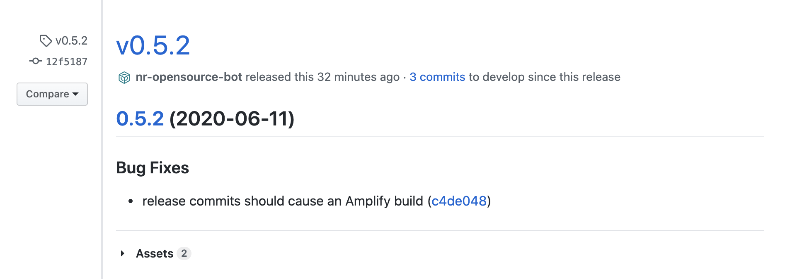
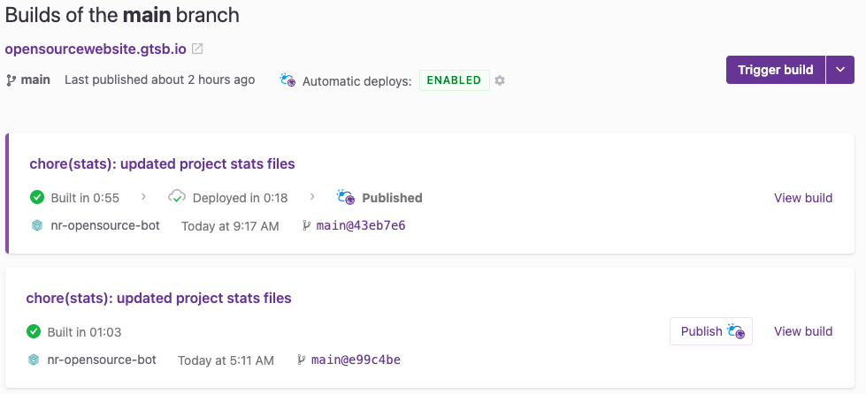
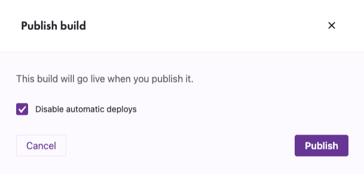

# Emergency Runbook -- opensource.newrelic.com

This site is hosted on [Gatsby Cloud](https://www.gatsbyjs.com/products/cloud/). It is maintained and supported by New Relic's Developer Enablement team. If you have any questions or comments, please reach out to <developer-enablement@newrelic.com>.

## Alerts

[Alerts](https://staging-one.newrelic.com/launcher/nrai.launcher?launcher=eyJhY2NvdW50SWQiOjEwMTc1MTA2fQ==&pane=eyJuZXJkbGV0SWQiOiJhbGVydGluZy11aS1jbGFzc2ljLnBvbGljaWVzIiwibmF2IjoiUG9saWNpZXMiLCJwb2xpY3lJZCI6IjUzNjE3In0=&sidebars[0]=eyJuZXJkbGV0SWQiOiJucmFpLm5hdmlnYXRpb24tYmFyIiwibmF2IjoiUG9saWNpZXMifQ==)

To diagnose a particular alert, we've started a [Common Issues](#Common-Issues)

## Rollback a release

Use the Gatsby Cloud UI to select a previous build and redeploy that build.

First, determine the desired previous build:

1. Navigate to the [Releases](https://github.com/newrelic/opensource-website/releases) tab in the opensource-website repo.
2. Determine which release to rollback to. Typically, this should be `latest_release - 1`. However, you might need to go back further. Click the commit hash (in this case, `12f5187`).
   
3. Use this commit message/hash value to locate the corresponding build in the Gatsby Cloud UI.
   

Steps to redeploy in Gatsby Cloud:

1. Log into Gatsby Cloud using your GitHub login. 
2. Select the `opensource-website` site, main branch.
   
3. Click the `View production history` button to see all the previous builds that have run.
4. Find the appropriate build corresponding to the release you located from the repo releases. This is the build to roll back to. Click `Publish` to select that build for deployment.
   
5. That should produce a pop up. Uncheck `Disable automatic deploys` and click `Publish`. 
6. Notify the hero in [#help-deven-websites](https://newrelic.slack.com/archives/C01R2TB8BUZ) of the rollback so we can address the underlying issue.

## Environments

This project supports three environments, local development, staging (a.ka. development), and production.

Note: When building the site, Gatsby coerces anything you've set in `NODE_ENV` to `production`

### Production

Corresponds to the [`main`](https://github.com/newrelic/opensource-website/main/develop) branch

New Relic Domains: [https://opensource.newrelic.com](https://opensource.newrelic.com)

[New Relic Browser monitoring](https://staging-one.newrelic.com/launcher/nr1-core.explorer?launcher=eyJVTlNUQUJMRV9maWx0ZXJzIjpbeyJ0eXBlIjoic2VhcmNoUXVlcnkiLCJ2YWx1ZSI6Im9wZW5zb3VyY2UifV0sInRhZ3MiOnt9LCJ0aW1lUmFuZ2UiOnsiYmVnaW5fdGltZSI6bnVsbCwiZW5kX3RpbWUiOm51bGwsImR1cmF0aW9uIjoxODAwMDAwfSwiJGlzRmFsbGJhY2tUaW1lUmFuZ2UiOnRydWV9&pane=eyJuZXJkbGV0SWQiOiJicm93c2VyLWVudGl0eS1wcmV2aWV3LmJyb3dzZXItYXBwbGljYXRpb24tcHJldmlldyIsImlzT3ZlcnZpZXciOnRydWUsImVudGl0eUlkIjoiTVRBeE56VXhNRFo4UWxKUFYxTkZVbnhCVUZCTVNVTkJWRWxQVG53eU1UVTBOemsyTkEifQ==&sidebars[0]=eyJuZXJkbGV0SWQiOiJucjEtY29yZS5hY3Rpb25zIiwiZW50aXR5SWQiOiJNVEF4TnpVeE1EWjhRbEpQVjFORlVueEJVRkJNU1VOQlZFbFBUbnd5TVRVME56azJOQSIsInNlbGVjdGVkTmVyZGxldCI6eyJuZXJkbGV0SWQiOiJicm93c2VyLWVudGl0eS1wcmV2aWV3LmJyb3dzZXItYXBwbGljYXRpb24tcHJldmlldyIsImlzT3ZlcnZpZXciOnRydWV9fQ==)

### Staging (Development)

Corresponds to the [`develop`](https://github.com/newrelic/opensource-website/tree/develop) branch

Gatsby Cloud Domain: [https://opensourcewebsitedevelop.gatsbyjs.io/](https://opensourcewebsitedevelop.gatsbyjs.io/)
New Relic Domains:

- [https://beta-opensource.newrelic-external.com](https://beta-opensource.newrelic-external.com)
- [https://staging-opensource.newrelic.com](https://staging-opensource.newrelic.com)

[New Relic Browser monitoring](https://staging-one.newrelic.com/launcher/nr1-core.explorer?launcher=eyJVTlNUQUJMRV9maWx0ZXJzIjpbeyJ0eXBlIjoic2VhcmNoUXVlcnkiLCJ2YWx1ZSI6Im9wZW5zb3VyY2UifV0sInRhZ3MiOnt9LCJ0aW1lUmFuZ2UiOnsiYmVnaW5fdGltZSI6bnVsbCwiZW5kX3RpbWUiOm51bGwsImR1cmF0aW9uIjoxODAwMDAwfSwiJGlzRmFsbGJhY2tUaW1lUmFuZ2UiOnRydWV9&pane=eyJuZXJkbGV0SWQiOiJicm93c2VyLWVudGl0eS1wcmV2aWV3LmJyb3dzZXItYXBwbGljYXRpb24tcHJldmlldyIsImlzT3ZlcnZpZXciOnRydWUsImVudGl0eUlkIjoiTVRBeE56VXhNRFo4UWxKUFYxTkZVbnhCVUZCTVNVTkJWRWxQVG53eU1UVTBPREl3TWciLCJhZ2dyZWdhdG9yIjoiQXZlcmFnZSJ9&sidebars[0]=eyJuZXJkbGV0SWQiOiJucjEtY29yZS5hY3Rpb25zIiwiZW50aXR5SWQiOiJNVEF4TnpVeE1EWjhRbEpQVjFORlVueEJVRkJNU1VOQlZFbFBUbnd5TVRVME9ESXdNZyIsInNlbGVjdGVkTmVyZGxldCI6eyJuZXJkbGV0SWQiOiJicm93c2VyLWVudGl0eS1wcmV2aWV3LmJyb3dzZXItYXBwbGljYXRpb24tcHJldmlldyIsImlzT3ZlcnZpZXciOnRydWV9fQ==)

### Local Development

To run, execute `yarn start` from the root of this repository.

Should you want Tessen instrumentation while developing locally, you will need to add an additional configuration option to `gatsby-config.js` for the `gatsby-plugin-newrelic` plugin.

## Architecture

The site is a combination of [template-generated pages](https://github.com/newrelic/opensource-website/tree/develop/src/templates) and [single pages](https://github.com/newrelic/opensource-website/tree/develop/src/pages) built using React, markup, and [MDX](https://mdxjs.com/).

Beyond the CI/CD automation, GitHub Actions are used to keep the [stats data](https://github.com/newrelic/opensource-website/tree/develop/src/data/project-stats) related to each [project](https://github.com/newrelic/opensource-website/tree/develop/src/data/projects) updated on a [scheduled basis](https://github.com/newrelic/opensource-website/blob/develop/.github/workflows/ci.yml#L4). Some of the architecture consequences of that change are described [here](https://github.com/newrelic/opensource-website#design-choice-project-stats-automation-commits-will-appear-out-of-sync).

## Common Issues

No issues yet!

## Help/Support Channels

- [@hero in #help-deven-websites](https://newrelic.slack.com/archives/C01R2TB8BUZ)
